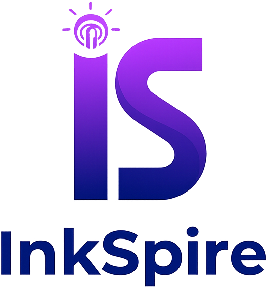

  

# InkSpire

## ⚠️ WARNING: Under Heavy Development ⚠️

**This project is currently under active and heavy development. It is NOT ready for general use and may contain bugs, incomplete features, or breaking changes. Use at your own risk.**

InkSpire is a modern web-based text editor designed for writers who want to leverage the power of AI to enhance their creative process. It provides a clean and organized interface for managing files and directories, along with AI-powered tools to rephrase, translate, and generate text.

---

## ✨ Features

- **AI-Powered Writing Tools**  
  Rephrase, translate, or expand text directly in your editor.
- **File System Navigation**  
  Hierarchical tree view to organize and manage your files.
- **Clean and Focused Editor**  
  A distraction-free writing environment with a modern interface.
- **Authentication**  
  Secure login system to protect your workspace.
- **Dynamic UI**  
  Smooth, interactive menus and modals for a polished user experience.

---

## 🧠 Technology Stack

| Component | Technology |
|-----------|------------|
| Frontend  | Vue.js, Vite, TypeScript |
| Backend   | Symfony, PHP 8.2+ |

---

## 📂 Projects

- [InkSpire Frontend](https://github.com/InkSpireEditor/inkspire-frontend) — The web-based text editor interface
- [InkSpire API](https://github.com/InkSpireEditor/inkspire-api) — The backend REST API

---

## 🧪 Quality and Testing

InkSpire uses **AI-assisted development** tools to accelerate coding, followed by **human validation** and **automated tests** for correctness.

---

## 📜 License

This project is released under the [MIT License](LICENSE).

---

## 💬 Acknowledgments

InkSpire is based on a code developed by:

- [Evann Abrial](https://www.linkedin.com/in/evann-abrial-26b446297/)
- [Lola Chalmin](https://www.linkedin.com/in/lola-chalmin-112ab9290/)
- [Roxane Rossetto](https://www.linkedin.com/in/roxane-rossetto-3b9158211/)

---

*© 2025 InkSpire. Built with care, code, and a bit of inkSpiration.*
