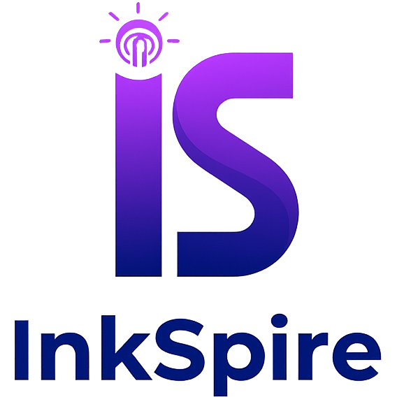

  

# InkSpire

## ⚠️ WARNING: Under Heavy Development ⚠️

**This project is currently under active and heavy development. It is NOT ready for general use and may contain bugs, incomplete features, or breaking changes. Use at your own risk.**

InkSpire is a web-based text editor for writing novels, with a language model available where you are already writing. It organises a novel as stories and chapters, generates continuations on request, and keeps a record of which words came from a model and which are yours.

---

## ✨ Features

- **Continuations from a language model**  
  Generate from where the chapter has got to, streamed a chunk at a time, from whichever
  provider is configured.
- **You can see what you wrote and what a model did**  
  Every character carries who wrote it, kept in the chapter file beside the prose, so it is
  still there after a reload.
- **File System Navigation**  
  Two tabs: a novel's stories and chapters, and everything that is not a novel.
- **Version control, built in**  
  The stories live in a git working tree, committed from the editor.
- **Clean and Focused Editor**  
  A distraction-free writing environment with a modern interface.
- **Authentication**  
  Secure login system to protect your workspace.
- **Dynamic UI**  
  Smooth, interactive menus and modals for a polished user experience.

---

## 🧠 Technology Stack

| Component | Technology |
|-----------|------------|
| Frontend  | Vue.js, Vite, TypeScript |
| Backend   | FastAPI, Python 3.12+ |
| Planning tools | rdflib, pySHACL, Typst |
| Storage | the filesystem, under git |

---

## 📂 Projects

- [InkSpire Frontend](https://github.com/InkSpireEditor/inkspire-frontend) — The web-based text editor interface
- [InkSpire API](https://github.com/InkSpireEditor/inkspire-api) — The backend REST API, and the
  `lorebook` and `timeline` commands for planning a novel

---

## 🧪 Quality and Testing

InkSpire uses **AI-assisted development** tools to accelerate coding, followed by **human validation** and **automated tests** for correctness.

---

## 📜 License

This project is released under the [PolyForm Noncommercial License 1.0.0](LICENSE). Any
noncommercial purpose is permitted, which the licence spells out as including personal
study, hobby projects and use by charities, schools, public research organisations and
government bodies. It grants no licence for commercial use. The `LICENSE` file is the
terms; this paragraph is not.

---

## 💬 Acknowledgments

InkSpire is based on a code developed by:

- [Evann Abrial](https://www.linkedin.com/in/evann-abrial-26b446297/)
- [Lola Chalmin](https://www.linkedin.com/in/lola-chalmin-112ab9290/)
- [Roxane Rossetto](https://www.linkedin.com/in/roxane-rossetto-3b9158211/)

---

*© 2025 InkSpire. Built with care, code, and a bit of inkSpiration.*
